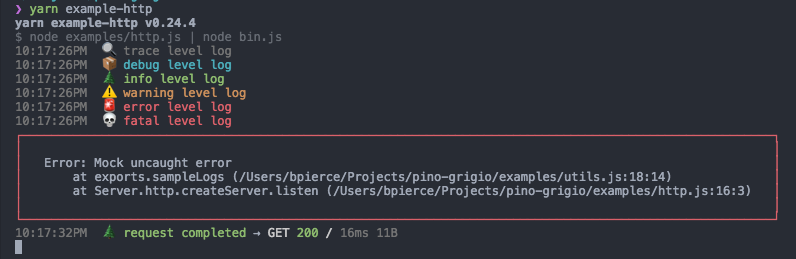

# 🍷 pino-grigio



A clean and development friendly transport for [`pino` logger](https://github.com/pinojs/pino) 🌲. WIP.

### Installation & Usage

```bash
$ npm i pino-grigio
```

```bash
$ node some-app.js | pino-grigio
```
